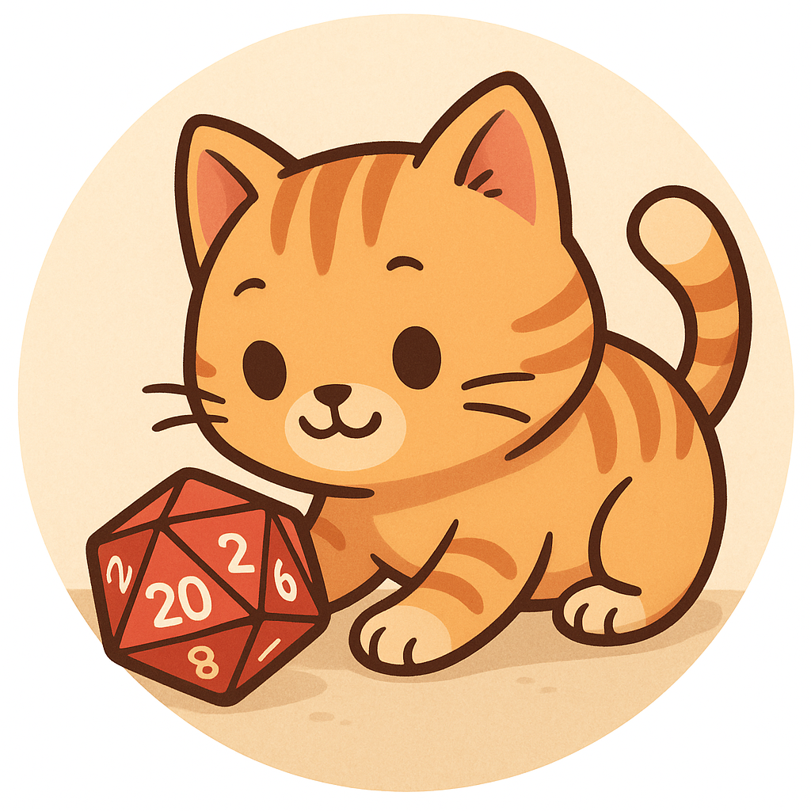

# 🎲 DiceCatBot (@diceMaster666_bot)

Телеграм-бот для бросков кубиков в настольных играх.  
Милый котик 🐱 будет кидать для вас кости: от стандартного D6 до D100. 

---

## ✨ Возможности
- `/start` — приветственное сообщение.  
- `/d20` — бросок одного 20-гранного куба.  
- `/roll XdY` — универсальная команда:  
  - `XdY` — бросить `X` кубов с `Y` гранями.  
  - Например:  
    - `/roll d6` → бросок одного D6.  
    - `/roll 3d20` → бросок трёх D20.  
    - `/roll 5d10` → бросок пяти D10.  

⚠️ Ограничение: не более **100 кубов за один раз**.

---

## Идеи для развития
- Поддержка модификаторов (/roll 2d20+5).
- Статистика бросков в группе.
- Кнопки для бросков.
- Мини игры.

## Стек
- [Node.JS](https://nodejs.org/ "Node.JS") 
- [node-telegram-bot-api](https://github.com/yagop/node-telegram-bot-api "GIT") 